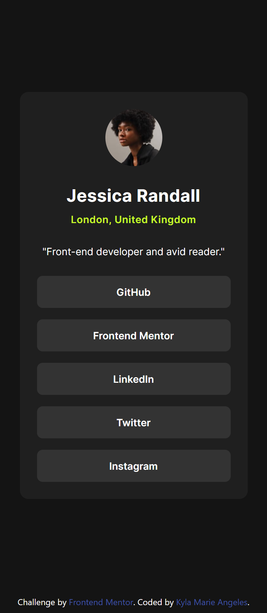
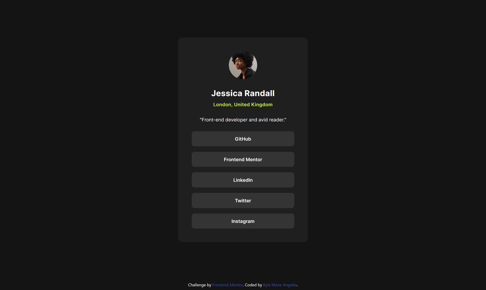
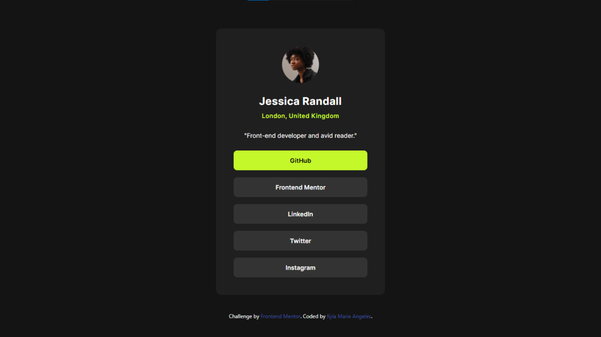

# Frontend Mentor - Social links profile solution

This is a solution to the [Social links profile challenge on Frontend Mentor](https://www.frontendmentor.io/challenges/social-links-profile-UG32l9m6dQ). Frontend Mentor challenges help you improve your coding skills by building realistic projects. 
## Table of contents

- [Overview](#overview)
- [My process](#my-process)
  - [Built with](#built-with)
  - [What I learned](#what-i-learned)
  - [Continued development](#continued-development)
- [Author](#author)

## Overview

This project is a solution to the Social links profile challenge on Frontend Mentor. The challenge was to build a clean, responsive Social links profile component that closely matches the design provided, using best practices for structure and styling.

- Live Demo
[View the Live Site](https://keilalily.github.io/fm-social-links-profile/)

- Mobile: 375px

- Desktop: 1440px

- Active State

## My Process

### Built with

- Semantic HTML5 markup
- Tailwind CSS

### What I learned

Working on this challenge helped me practice and improve:
- Writing semantic and accessible HTML
- Using Tailwind CSS utility classes to build responsive layouts
- Creating custom Tailwind configurations, such as extending themes for breakpoints and customizing fonts and colors
- Creating reusable styles for a component

### Continued development

In future projects, I want to continue improving my skills with Tailwind CSS. While building this component, I got more comfortable using utility classes for layout and spacing, but I’d like to focus more on:
- Structuring larger, more complex layouts with Tailwind
- Making better use of Tailwind's responsive design utilities
- Improving consistency and maintainability when using utility-first CSS in real-world projects

## Author

- Frontend Mentor - [@keilalily](https://www.frontendmentor.io/profile/keilalily)